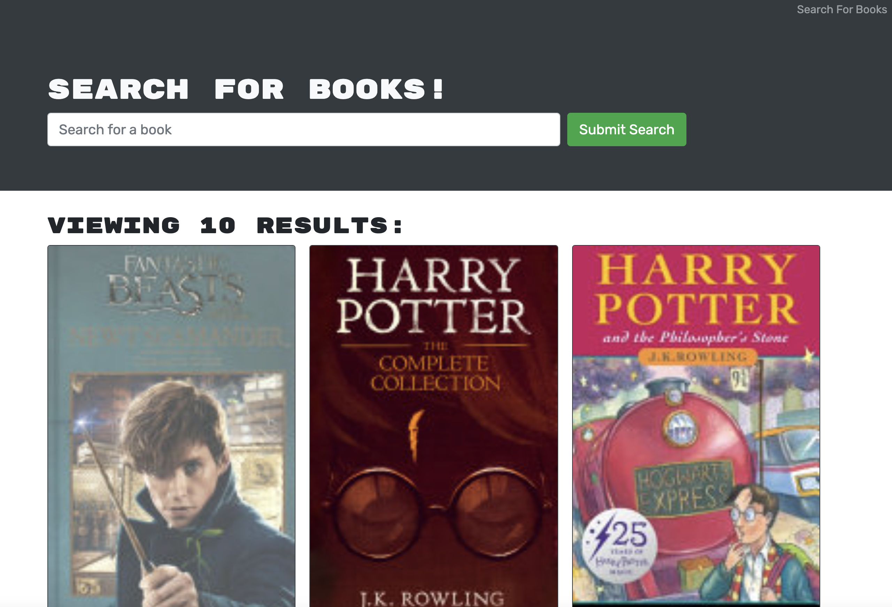

    
    
    
    
    
    

# Book Search Engine 📚

The book search engine is a full MERN website, built with MongoDB, Express.JS, React and Node.JS; powered by the google book search API.

## Quirks 🎯

You can create an account in which you can store your favorite books after you've performed a basic search for them.

## Preview 👀

[Live site](https://book-search-engine2929.netlify.app/)

## License 📓

[MIT](https://choosealicense.com/licenses/mit/)
